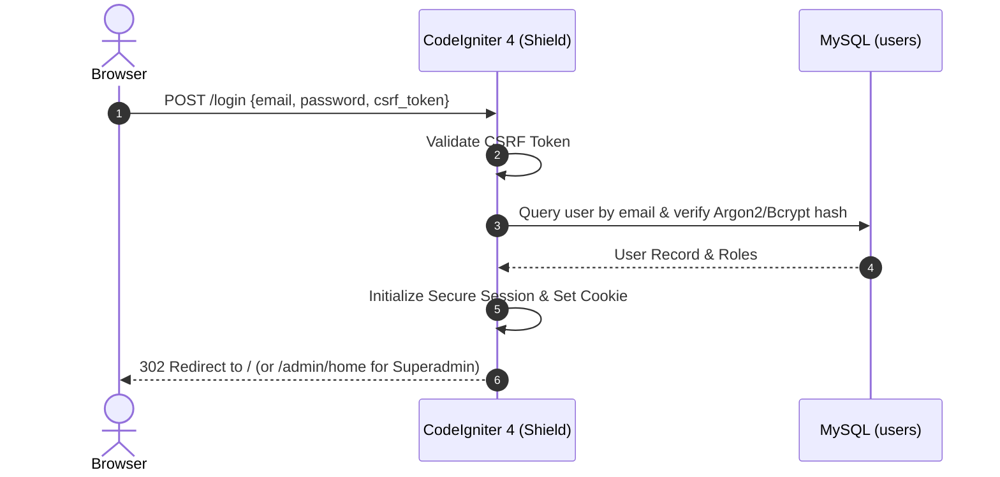
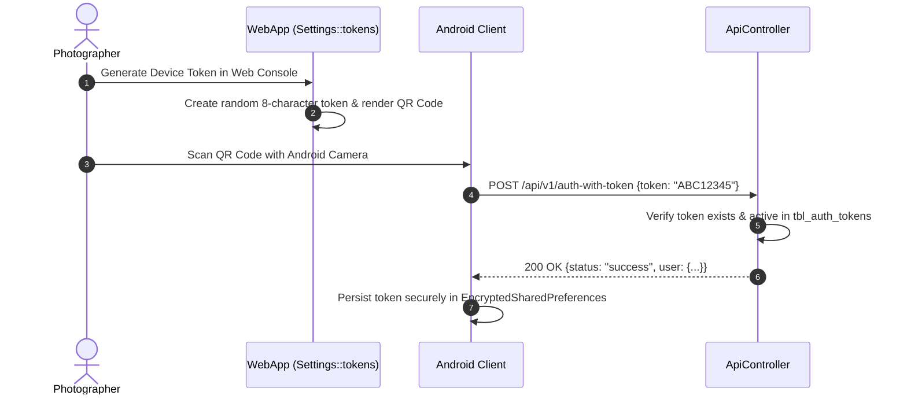
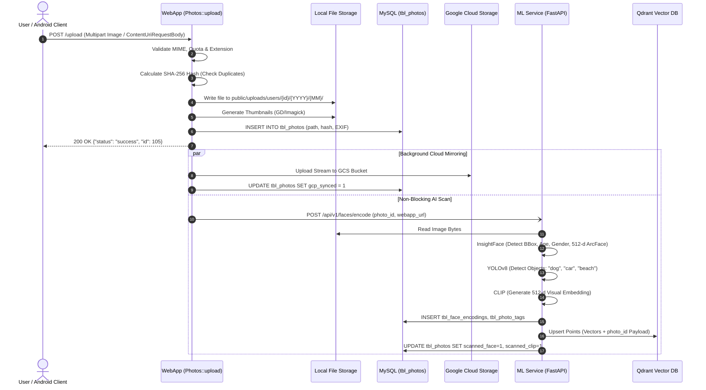
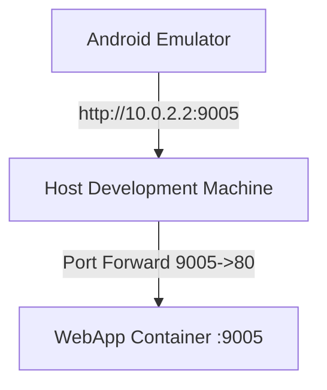

# Inter-Service Communication & Protocols

Protocols, communication tables, sequence diagrams, and failure strategies connecting Chege Photos WebApp with databases, microservices, and mobile clients.

---

## 1. Inter-Service Protocol Matrix

| Source | Target | Transport | Authentication | Base URL (Dev) | Timeout & Fallback Strategy |
|---|---|---|---|---|---|
| **Browser** | **WebApp** | HTTPS + Cookie | Shield Session Cookie | `http://localhost:9005` | CSRF token validation; 302 redirect to `/login` if unauthenticated. |
| **Android** | **WebApp** | HTTPS / REST | Bearer Token (`tbl_auth_tokens`) | `http://10.0.2.2:9005` | Returns 401 JSON; app queues actions locally in Room database. |
| **WebApp** | **MySQL** | TCP 3306 | MySQL User/Password | `mysql:3306` | Connection wait loop in `entrypoint.sh` with 30 retries. |
| **WebApp** | **ML Service** | HTTP/1.1 (cURL) | Header `X-API-KEY` | `http://ml-chege-photos:9051` | Non-blocking async (`100ms` timeout); upload succeeds if ML down. |
| **ML Service** | **WebApp** | HTTP/1.1 | Session / Internal HMAC | `http://chege-photos:80` | On-demand fallback hydration streams missing images from WebApp. |
| **WebApp** | **Google Cloud** | HTTPS 443 | Service Account OAuth2 Bearer | `storage.googleapis.com` | Photos flagged `gcp_synced=0` and retried via `php spark cloud:sync`. |

---

## 2. Authentication & Session Sequences

### Web User Login Sequence

### Android Mobile Token Pairing Sequence

---

## 3. Photo Upload & Asynchronous AI Scanning Data Flow

---

## 4. Android Emulator Networking

