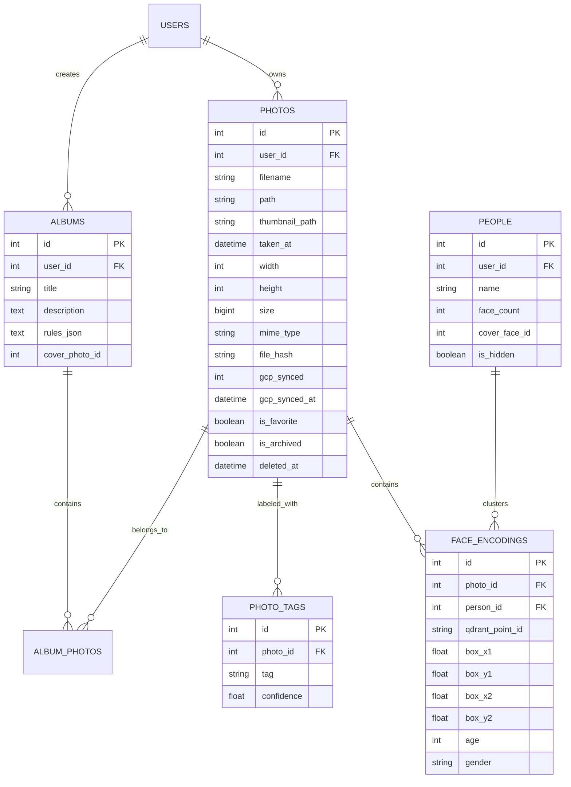

# Data, Schema & Storage Architecture

Relational database schemas, local disk hierarchies, Google Cloud Storage mirroring, and ephemeral rehydration patterns for Chege Photos WebApp.

---

## 1. Storage Layout & Directory Structure

All media is organized in a strict user-isolated and date-based hierarchy under `public/`:

```
public/
├── uploads/
│   └── users/
│       └── {user_id}/
│           └── {YYYY}/
│               └── {MM}/
│                   └── {random_name}.jpg       # Original photo/video file
└── thumbnails/
    └── users/
        └── {user_id}/
            └── {YYYY}/
                └── {MM}/
                    └── {random_name}.jpg       # Web-optimized thumbnail
```

---

## 2. Hybrid Ephemeral Rehydration Pattern (`MediaFallback.php`)

To support cloud platforms with ephemeral disks (Railway, Render, Fly.io), the WebApp implements the **Hybrid On-Demand Rehydration Pattern**:

1. **Request Interception**: Missing image requests under `uploads/` or `thumbnails/` hit Apache's rewrite rules and route to `MediaFallback::serveMedia()`.
2. **Subpath Preservation**: The controller sanitizes each component of the path individually to prevent directory traversal while preserving the full directory structure:
   ```php
   $segments = explode('/', $subPath);
   $sanitized = array_map('basename', $segments);
   $cleanPath = implode('/', $sanitized);
   ```
3. **Bucket Retrieval**: `GcpStorageService` streams the object from Google Cloud Storage.
4. **Local Cache Rehydration**: The parent directories (`users/{id}/{YYYY}/{MM}/`) are automatically created on local disk (`mkdir($dir, 0777, true)`), and the file is written to local disk for subsequent zero-overhead requests before streaming to the client.

---

## 3. Database Schema Reference (MySQL 8.4)

Managed via 24 versioned CodeIgniter migrations in `app/Database/Migrations/`:



---

## 4. Key Table Schemas

### `tbl_photos`
The primary catalog table. Key columns include:
- `file_hash` (`VARCHAR(64)`): SHA-256 binary hash used for duplicate detection.
- `gcp_synced` (`TINYINT(1)`): Flag indicating whether the file has been mirrored to GCS (`1` = yes, `0` = pending).
- `gcp_synced_at` (`DATETIME`): Timestamp of last cloud sync.
- `deleted_at` (`DATETIME`): CodeIgniter soft-delete timestamp. Trashed photos are purged after 60 days via `php spark trash:purge`.

### `tbl_photo_tags`
Stores real-world object labels detected by the YOLOv8 model in the ML microservice. Joined during Explore searches and tag filtering.

### `tbl_face_encodings`
Stores face metadata and bounding box landmarks. The high-dimensional 512-d feature vector is indexed in **Qdrant** using `qdrant_point_id` (`VARCHAR(36)`), keeping the MySQL table fast and light.
