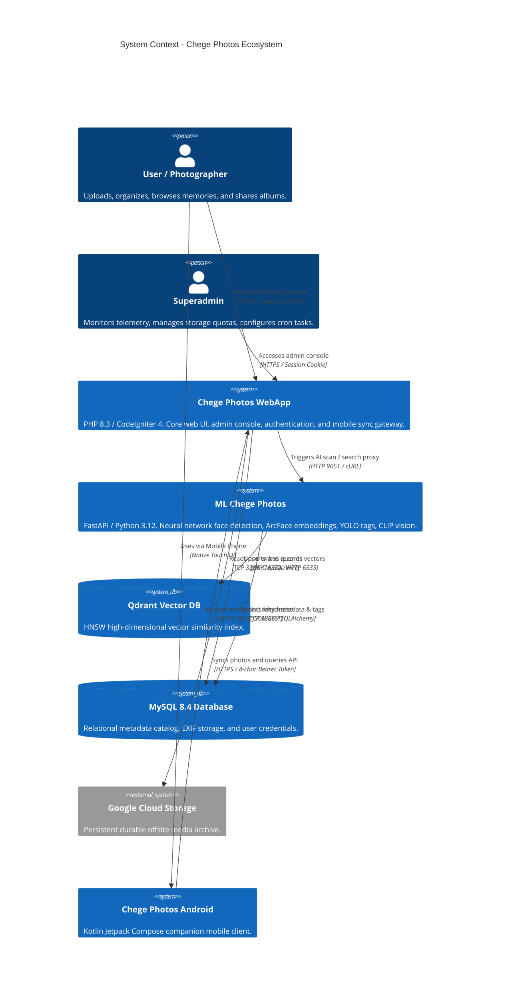

# Architecture Overview

System context, container topology, component responsibilities, and trust boundaries for Chege Photos WebApp.

---

## 1. System Context Diagram

---

## 2. Container Topology

| Container / Service | Technology | Port (Internal) | Port (Host / Dev) | Responsibility |
|---|---|---|---|---|
| `chege-photos-webapp` | PHP 8.3 Apache | `80` | `9005` | Web controllers, views, REST API, fallback hydration, cron runner |
| `shared-mysql` | MySQL 8.4 | `3306` | `9306` | Relational storage for users, photos, albums, and system logs |
| `shared-phpmyadmin` | phpMyAdmin | `80` | `9000` | Database administration and query inspection interface |
| `ml-service` (optional) | FastAPI / PyTorch | `9051` | `9051` | Asynchronous face detection, object tagging, and vector generation |
| `ml-qdrant` (optional) | Qdrant | `6333` / `6334` | `9052` / `9053` | Sub-second HNSW cosine vector similarity indexing |

---

## 3. Trust Boundaries & Security Architecture

1. **Web Browser Boundary**:
   - Authenticated via CodeIgniter Shield session cookies with `HttpOnly`, `SameSite=Lax`, and secure session handling.
   - CSRF protection enabled across all POST/PUT/DELETE web form submissions.
2. **Mobile REST Boundary**:
   - Uses cryptographic 8-character device tokens passed in the `Authorization: Bearer <token>` header.
   - Bypasses CSRF filter; validated against `tbl_auth_tokens` on every request.
3. **ML Service Proxy Boundary**:
   - Internal microservice communication requires the `X-API-KEY` secret header.
   - Non-blocking cURL calls use short timeouts ($\le 100\text{ms}$) so external ML downtime never blocks the client.
4. **Multi-Tenant Row-Level Security**:
   - Every database query strictly binds `user_id = auth()->id()`.
   - SQL queries with `OR` clauses use strict `groupStart()` and `groupEnd()` blocks to eliminate cross-tenant data leaks.
